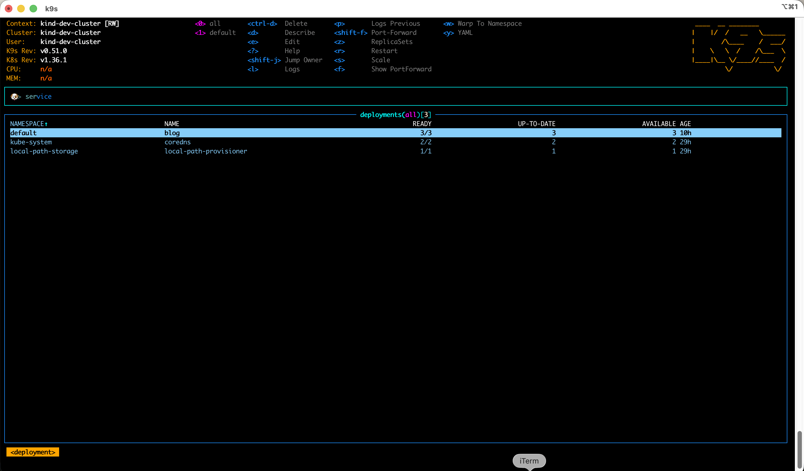
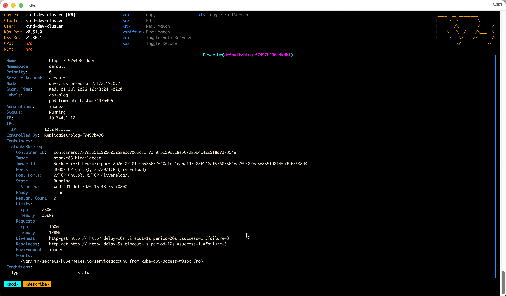

After years of actively avoiding learning and working with Kubernetes it finally caught up with me. I am currently learning basics, real basics, and it's going good for now.

I am using [kind](https://kind.sigs.k8s.io/) to run the cluster locally and I installed kubectl on my Mac so I can test and try things out. 

Kubectl is OK for running commands in the terminal but it can really fast become tedious to check all the pods, services, logs… that I deployed and inspect what is running locally.
I'm using VS Code and Kubernetes plugin from Microsoft to check the deployed stuff. It looked better compared to just using kubectl but then, talking to colleague, he mentioned [**k9s**](https://k9scli.io/).

**k9s** is what you want from a tool in the terminal. It's very interactive and it shows you really all the info you need about your cluster. You can navigate through pods, services, deployments, logs, nodes…

Where it shines is support for searching and great shortcuts that allow you to very quickly navigate through the resources.
User experience is great and UI is also very nice for a terminal tool.

Important thing is that if you have multiple clusters for maybe multiple projects or environments, it can handle them all and you can switch between them easily. 

Give it a try, it's one of those tools that just "click" with you :)